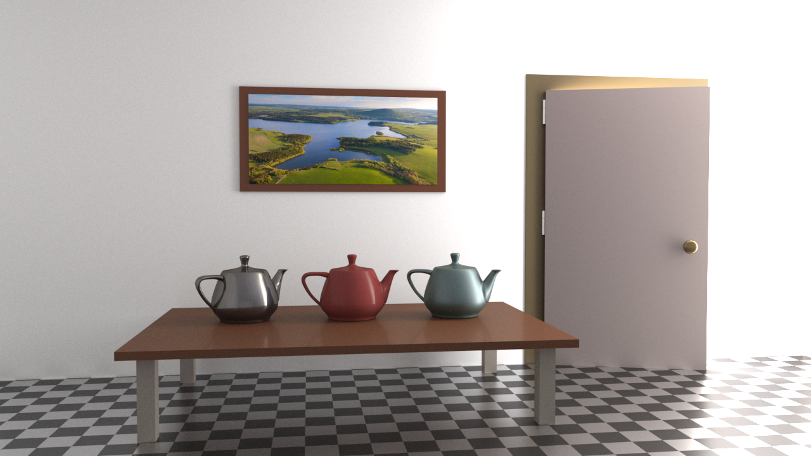

[](https://www.python.org/downloads/release/python-38/)
[](https://pytorch.org/)


# Hypernetworks for Generalizable BRDF Representation, ECCV 2024

[Project page](https://faziletgokbudak.github.io/HyperBRDF/) | [Paper](https://link.springer.com/chapter/10.1007/978-3-031-73116-7_5)

[comment]: <> (| [Supplementary materials]&#40;https://inbarhub.github.io/DDPM_inversion/resources/inversion_supp.pdf&#41; | [Hugging Face Demo]&#40;https://huggingface.co/spaces/LinoyTsaban/edit_friendly_ddpm_inversion&#41;### Official pytorch implementation of the paper: <br>"Hypernetworks for Generalizable BRDF Estimation")
#### F. Gokbudak A. Sztrajman, C Zhou, F. Zhong, R. Mantiuk, and C. Oztireli
<br>


Our hypernetwork model offers a **neural continuous BRDF representation** that can be used either for sparse BRDF reconstruction of unseen materials or compression of highly densed BRDF samples. 

The figure shows a room scene rendered with our reconstructed materials, including sparse reconstruction (table top and legs, door, door and picture frames, hinge), full reconstruction through compression (the two teapots on the left, door handle) and BRDF interpolation (right-most teapot). Scene courtesy of Benedikt Bitterli.

This repository contains all necessary scripts for both training and testing our model.


## Table of Contents
* [Requirements](#Requirements)
* [Repository Structure](#Repository-Structure)
* [Usage Example](#Usage-Example)
* [Citation](#Citation)

## Requirements 

```
python -m pip install -r requirements.txt
```
This code was tested with python 3.8 and torch==1.8.1+cu111. 

## Repository Structure 
```
├── data - folder contains precomputed median files for both MERL and RGL dataset, which are necessary for our pre-processing step.
├── models.py - contains main HyperBRDF model
├── main.py - main python file for model training
└── test.py - test python file for computing hyponet parameters from **sparse** BRDF samples (inference)
└── pt_to_fullmerl.py - test python file for querying new sampling directions and reconstructing BRDFs (inference)

```

A folder named with --destdir arg will be automatically created and all the results will be saved to this folder.


### 准备步骤，计算MERL和RGL数据集的中位数

python compute_median.py

### 步骤一生成初始生成器

Tranin:

```
python main.py --destdir results/test --binary data/ --dataset MERL --kl_weight 0.1 --fw_weight 0.1 --epochs 100 --sparse_samples 4000
```

### 步骤二从稀疏样本计算材质参数 (.pt)

Inference with pre-trained model:

```
python test.py --model results/test/MERL/checkpoint.pt --binary data/ --destdir results/pt_results/ --dataset MERL
```

### 步骤三生成fullbin文件、

```
python pt_to_fullmerl.py results/pt_results/ results/fullbin_results/ --dataset MERL
```

### 运行自动化批处理脚本

```
python batch_process.py
```

## Citation

If you use this code for your research, please cite our paper:
```
@inproceedings{gokbudak2024hypernetworks,
  title={Hypernetworks for Generalizable BRDF Representation},
  author={Gokbudak, Fazilet and Sztrajman, Alejandro and Zhou, Chenliang and Zhong, Fangcheng and Mantiuk, Rafal and Oztireli, Cengiz},
  booktitle={European Conference on Computer Vision},
  pages={73--89},
  year={2024},
  organization={Springer}
}
```
训练轮次100，稀疏采样点数4000，潜在空间维度40，使用ReLU激活函数，除了训练轮次以外基本都和文献里保持一致